# 📚 BookExchange

A full-stack book exchange platform where readers list, discover, and trade books using a point-based economy — powered by AI valuation, real-time chat, community forums, and interactive map-based exchange stalls.

Built with **Next.js 16**, **React 19**, **TypeScript**, **tRPC**, **Prisma + MongoDB**, and **Google Gemini AI**.

---

## What It Does

BookExchange replaces the typical buy/sell model with a **point-based exchange system**. Every user starts with 1,000 points. Listing a book earns you points, requesting a book costs points. The point value of each book is calculated by an AI model that factors in condition, demand (pending requests), and rarity (copies in the system).

Beyond the exchange, there's a forum for reader discussions, a real-time chat system for negotiating trades, a map of physical exchange stalls, and an AI chatbot (BookBot) that helps users discover books.

---

## Architecture

```mermaid
graph TB
    subgraph Client["Client Layer"]
        direction TB
        UI["Next.js 16 App Router<br/>React 19 · TypeScript · Tailwind v4"]
        ANIM["Framer Motion · GSAP<br/>Lucide Icons · Leaflet Maps"]
        STATE["TanStack React Query<br/>tRPC Client · Pusher JS"]
        UI --> ANIM
        UI --> STATE
    end

    subgraph Server["Server Layer"]
        direction TB
        API["Next.js API Routes"]
        TRPC["tRPC Routers"]
        MW["Middleware<br/>Auth Guard · Email Verification"]
        API --> TRPC
        API --> MW
        subgraph Routers["Router Modules"]
            R1["book"]
            R2["exchange"]
            R3["forum"]
            R4["chat"]
            R5["bookBot"]
            R6["bookHistory"]
            R7["readingInsights"]
        end
        TRPC --> Routers
    end

    subgraph External["External Services"]
        direction TB
        DB[("MongoDB<br/>Prisma ORM")]
        AI["Google Gemini AI"]
        STRIPE["Stripe Payments"]
        PUSH["Pusher WebSockets"]
        CLOUD["Cloudinary CDN"]
        EMAIL["Brevo SMTP"]
        OAUTH["Google & GitHub OAuth"]
    end

    subgraph Data["Data Models"]
        direction LR
        M1["User"] --- M2["Book"] --- M3["BookRequest"]
        M4["PointTransaction"] --- M5["Conversation"] --- M6["Message"]
        M7["ForumDiscussion"] --- M8["ForumReply"] --- M9["ExchangePoint"]
        M10["BookHistoryEntry"]
    end

    Client -->|tRPC| Server
    Client -->|WebSocket| PUSH
    Server --> DB
    Server --> AI
    Server --> STRIPE
    Server --> PUSH
    Server --> CLOUD
    Server --> EMAIL
    MW --> OAUTH
    DB --> Data
```



| Layer | Stack | Role |
|-------|-------|------|
| Frontend | Next.js 16, React 19, Tailwind v4 | SSR/CSR hybrid, responsive UI |
| Animations | Framer Motion, GSAP | Transitions, micro-interactions |
| Data Fetching | tRPC + TanStack Query | End-to-end typesafe API with caching |
| Auth | Better Auth (email + Google + GitHub) | Session management, email verification |
| Database | MongoDB + Prisma ORM | Document store, 12 models, indexed queries |
| AI | Google Gemini | Book valuation, recommendations, chatbot, insights |
| Payments | Stripe Checkout | Buy points via card |
| Real-time | Pusher | Live chat, notifications |
| Media | Cloudinary | Image upload and CDN |
| Email | Brevo SMTP via Nodemailer | Verification and password reset emails |
| Maps | Leaflet + React-Leaflet | Exchange stall geolocation |

---

## Features

### Book Exchange & Points Economy
- List books with condition grading (New → Acceptable), images, and location
- AI-driven book valuation using Gemini — factors in condition, supply, and demand
- Request books from other users by spending points
- Accept/decline/cancel requests with automatic point transfers
- Transaction history with full audit trail
- Buy additional points through Stripe checkout

### AI-Powered (Gemini)
- **Book Valuation** — dynamic point pricing based on condition, rarity, and demand
- **Personalized Recommendations** — analyzes your owned books, requests, and reading history to suggest matches
- **BookBot** — floating AI chatbot that helps discover books, answers platform questions, and suggests exchanges
- **Reading Insights** — generates personality-type analysis, favorite genres, reading pace, and fun facts from your history
- **Reading Time Estimation** — predicts reading duration based on book title, author, and description

### Community Forums
- Category-based discussions: Reader Discussions, Chapter Debates, Interpretations, Book Reviews, Recommendations
- Threaded replies with nested comments
- Reaction system (Like, Helpful, Insightful, Agree, Disagree)
- Abuse reporting with moderation workflow
- Anonymous posting support
- Profanity filtering via `bad-words`

### Real-Time Chat
- Direct messaging between users about specific books
- Pusher-powered live message delivery
- Unread message counts
- Conversation history with pagination

### Exchange Points (Stalls)
- Register physical exchange locations on an interactive Leaflet map
- Each stall has name, description, images, contact info, and coordinates
- Browse nearby exchange stalls geographically
- Active/Inactive/Verified status system

### Book History & QR Journey
- Every book gets a unique digital ID
- Track a book's journey across readers and cities
- Readers log their reading duration, city, optional notes, tips, and ratings
- History is preserved even if users are deleted
- Anonymous entries supported

### Auth & User Management
- Email/password sign-up with email verification
- Google and GitHub OAuth
- Password reset via email
- Middleware-enforced route protection
- Theme toggle (light/dark/system)

---

## Project Structure

```
bookexchange-beta/
├── prisma/
│   └── schema.prisma            # 12 models, MongoDB datasource
├── public/
│   └── images/                  # Static assets
├── scripts/
│   ├── test-create-point.js     # Exchange point seeding
│   └── verify-prisma.js         # DB connection test
├── src/
│   ├── app/
│   │   ├── api/
│   │   │   ├── auth/            # Better Auth handler
│   │   │   ├── exchange-points/ # REST endpoints for stalls
│   │   │   ├── stripe/          # Checkout + webhook
│   │   │   ├── trpc/            # tRPC HTTP handler
│   │   │   └── upload/          # Cloudinary upload
│   │   ├── books/               # Browse & detail pages
│   │   ├── book-history/        # QR journey viewer
│   │   ├── chat/                # Real-time messaging
│   │   ├── exchange-points/     # Map + stall management
│   │   ├── forums/              # Discussion threads
│   │   ├── requests/            # Incoming/outgoing requests
│   │   ├── settings/            # User settings
│   │   ├── wallet/              # Points balance + buy
│   │   ├── signin/              # Auth pages
│   │   ├── signup/
│   │   ├── verify-email/
│   │   ├── forgot-password/
│   │   ├── reset-password/
│   │   ├── layout.tsx           # Root layout (Header + BookBot)
│   │   └── page.tsx             # Landing page
│   ├── components/
│   │   ├── books/               # BookCard, BookGrid, AddBookForm, QRCode, AIRecommendations
│   │   ├── exchange/            # Map, RequestBookModal, PointsDisplay, TransactionHistory
│   │   ├── forum/               # DiscussionCard, ReplyCard, CreateDiscussionModal
│   │   ├── BookBot.tsx          # Floating AI chatbot
│   │   ├── Header.tsx           # Navigation
│   │   ├── NotificationDropdown.tsx
│   │   ├── ReadingInsights.tsx
│   │   └── ThemeToggle.tsx
│   ├── lib/
│   │   ├── auth.ts              # Better Auth config
│   │   ├── auth-client.ts       # Client-side auth
│   │   ├── db.ts                # Prisma client
│   │   ├── email-service.ts     # Nodemailer + Brevo
│   │   ├── gemini.ts            # All 5 AI features
│   │   ├── pusher.ts            # Server-side Pusher
│   │   ├── pusher-client.ts     # Client-side Pusher + notifications
│   │   ├── stripe.ts            # Stripe config
│   │   └── trpc.ts              # tRPC client hooks
│   ├── server/
│   │   ├── trpc.ts              # tRPC context + procedures
│   │   └── routers/
│   │       ├── _app.ts          # Root router
│   │       ├── book.ts          # CRUD, recommendations, reading time
│   │       ├── exchange.ts      # Requests, valuations, point transfers
│   │       ├── forum.ts         # Discussions, replies, reactions, reports
│   │       ├── chat.ts          # Conversations + real-time messaging
│   │       ├── bookBot.ts       # AI chatbot endpoint
│   │       ├── bookHistory.ts   # Digital journey tracking
│   │       └── readingInsights.ts
│   └── middleware.ts            # Auth guard + email verification
├── Dockerfile                   # Production container
├── package.json
└── tsconfig.json
```

---

## Getting Started

### Prerequisites

- Node.js 22+
- MongoDB instance (Atlas or local)
- Accounts/keys for: Google Cloud (Gemini + OAuth), GitHub OAuth, Stripe, Pusher, Cloudinary, Brevo

### Setup

1. **Clone and install**
   ```bash
   git clone https://github.com/umerkang66/bookexchange-beta.git
   cd bookexchange-beta
   npm install
   ```

2. **Configure environment**

   Copy `.env.example` to `.env` and fill in:
   ```env
   DATABASE_URL="mongodb+srv://..."
   BETTER_AUTH_SECRET="your-secret-key-min-32-chars-long"
   BETTER_AUTH_URL="http://localhost:3000"
   NEXT_PUBLIC_APP_URL="http://localhost:3000"

   # OAuth
   GOOGLE_CLIENT_ID=""
   GOOGLE_CLIENT_SECRET=""
   GITHUB_CLIENT_ID=""
   GITHUB_CLIENT_SECRET=""

   # Services
   GEMINI_API_KEY=""
   BREVO_USER=""
   BREVO_PASS=""
   NEXT_PUBLIC_PUSHER_KEY=""
   NEXT_PUBLIC_PUSHER_CLUSTER=""
   PUSHER_APP_ID=""
   PUSHER_SECRET=""
   CLOUDINARY_NAME=""
   CLOUDINARY_API_KEY=""
   CLOUDINARY_API_SECRET=""
   NEXT_PUBLIC_STRIPE_PUBLISHABLE_KEY=""
   STRIPE_SECRET_KEY=""
   STRIPE_WEBHOOK_SECRET=""
   ```

3. **Generate Prisma client**
   ```bash
   npx prisma generate
   ```

4. **Run dev server**
   ```bash
   npm run dev
   ```
   Open [http://localhost:3000](http://localhost:3000).

### Stripe Webhooks (Local)

```bash
stripe listen --forward-to localhost:3000/api/stripe/webhook
```

### Docker

```bash
docker build -t bookexchange .
docker run -p 3000:3000 --env-file .env bookexchange
```

---

## Database Schema

12 models across 4 domains:

**Users & Auth** — `User`, `Session`, `Account`, `Verification`

**Book Exchange** — `Book` (with digital ID, condition, location, AI-calculated point value), `BookRequest` (status workflow: Pending → Accepted → Completed), `PointTransaction` (earned/spent/refunded/bonus)

**Community** — `ForumDiscussion`, `ForumReply`, `ForumReaction`, `ForumReport`

**Messaging** — `Conversation` (scoped to a book + two participants), `Message`

**Physical** — `ExchangePoint` (stalls with geolocation)

**History** — `BookHistoryEntry` (reader journey with city, duration, notes — preserved on user deletion)

---

## Scripts

| Script | Purpose |
|--------|---------|
| `npm run dev` | Start development server |
| `npm run build` | Production build |
| `npm run start` | Start production server |
| `npm run lint` | Run ESLint |
| `npx prisma generate` | Regenerate Prisma client |
| `npx prisma db push` | Push schema to database |

---

## Tech Stack Summary

| Category | Technologies |
|----------|-------------|
| Framework | Next.js 16, React 19, TypeScript |
| Styling | TailwindCSS v4, Framer Motion, GSAP |
| API | tRPC v11, Zod validation |
| Database | MongoDB, Prisma v6 |
| Auth | Better Auth, Google OAuth, GitHub OAuth |
| AI | Google Gemini (Generative AI SDK) |
| Payments | Stripe (Checkout Sessions + Webhooks) |
| Real-time | Pusher (WebSockets) |
| Media | Cloudinary |
| Email | Nodemailer + Brevo SMTP |
| Maps | Leaflet, React-Leaflet |
| Icons | Lucide React |
| Deployment | Docker, Next.js Standalone |

---

## License

This project is private and not currently licensed for public distribution.
