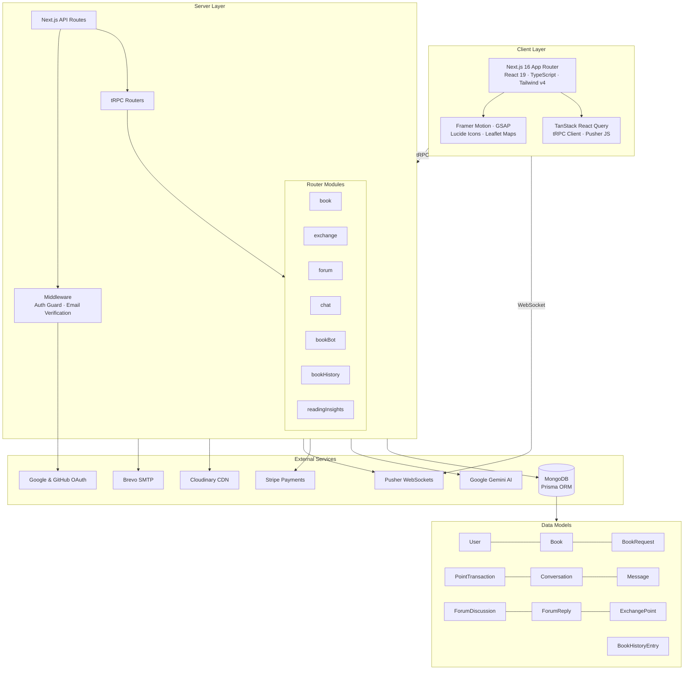

# Architecture

BookExchange follows a **layered architecture** with clear separation between client, server, and external services.

  
   
  <em>High-level system architecture diagram</em>

---

## System Diagram

---

## Layer Breakdown

| Layer             | Stack                                 | Role                                               |
| :---------------- | :------------------------------------ | :------------------------------------------------- |
| **Frontend**      | Next.js 16, React 19, Tailwind v4     | SSR/CSR hybrid rendering, responsive UI            |
| **Animations**    | Framer Motion, GSAP                   | Page transitions, micro-interactions               |
| **Data Fetching** | tRPC + TanStack Query                 | End-to-end typesafe API with caching               |
| **Auth**          | Better Auth (Email + Google + GitHub) | Session management, email verification             |
| **Database**      | MongoDB + Prisma ORM                  | Document store, 16 models, indexed queries         |
| **AI**            | Google Gemini                         | Book valuation, recommendations, chatbot, insights |
| **Payments**      | Stripe Checkout + Webhooks            | Purchase points via card                           |
| **Real-time**     | Pusher (WebSockets)                   | Live chat, notifications                           |
| **Media**         | Cloudinary                            | Image upload and CDN delivery                      |
| **Email**         | Brevo SMTP via Nodemailer             | Verification and password reset emails             |
| **Maps**          | Leaflet + React-Leaflet               | Exchange stall geolocation                         |

---

## Data Flow

1. **Client → Server**: All API calls go through tRPC with end-to-end type safety. TanStack Query handles caching, invalidation, and optimistic updates.
2. **Server → Database**: Prisma ORM provides type-safe MongoDB queries with 16 indexed models.
3. **Real-time**: Pusher WebSockets push live chat messages and notifications directly to connected clients.
4. **AI Pipeline**: Server-side calls to Google Gemini for book valuation, recommendations, chatbot responses, reading insights, and time estimation.
5. **Auth Flow**: Better Auth manages sessions with email/password, Google OAuth, and GitHub OAuth. Middleware enforces route protection and email verification.
6. **Payments**: Stripe Checkout Sessions handle point purchases, with webhooks for asynchronous payment confirmation.
