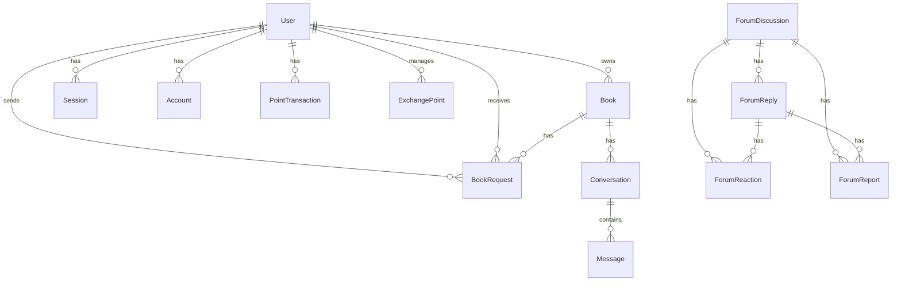

# Database Schema

BookExchange uses **MongoDB** with **Prisma ORM v6**. The schema contains **16 models** organized across 6 domains.

---

## Entity Relationship Overview

---

## Users & Auth

| Model            | Fields                                                                    | Purpose                                      |
| :--------------- | :------------------------------------------------------------------------ | :------------------------------------------- |
| **User**         | id, name, email, emailVerified, image, points (default: 1000), timestamps | Core user profile with points balance        |
| **Session**      | id, expiresAt, token, ipAddress, userAgent, userId                        | Active user sessions                         |
| **Account**      | id, accountId, providerId, userId, tokens                                 | OAuth provider accounts (Google, GitHub)     |
| **Verification** | id, identifier, value, expiresAt                                          | Email verification and password reset tokens |

---

## Book Exchange

| Model                | Fields                                                                                                                     | Purpose                                |
| :------------------- | :------------------------------------------------------------------------------------------------------------------------- | :------------------------------------- |
| **Book**             | id, digitalId (UUID), title, author, description, condition, images[], location, lat/lng, isAvailable, pointValue, ownerId | Book listings with AI-calculated value |
| **BookRequest**      | id, bookId, requesterId, ownerId, pointsOffered, status, message                                                           | Exchange requests with workflow        |
| **PointTransaction** | id, userId, amount, type, description, bookId                                                                              | Full transaction ledger                |

### Book Condition Enum

`NEW` · `LIKE_NEW` · `VERY_GOOD` · `GOOD` · `ACCEPTABLE`

### Request Status Workflow

`PENDING` → `ACCEPTED` → `COMPLETED` | `DECLINED` | `CANCELLED`

### Transaction Types

`EARNED_LISTING` · `EARNED_EXCHANGE` · `SPENT_REQUEST` · `REFUND` · `BONUS`

---

## Community Forums

| Model               | Fields                                                                                                                         | Purpose                                                |
| :------------------ | :----------------------------------------------------------------------------------------------------------------------------- | :----------------------------------------------------- |
| **ForumDiscussion** | id, title, content, category, bookTitle, bookAuthor, chapter, authorId, authorName, isAnonymous, isPinned, isLocked, viewCount | Discussion threads                                     |
| **ForumReply**      | id, content, discussionId, authorId, authorName, isAnonymous, parentId, isEdited                                               | Threaded replies with nesting                          |
| **ForumReaction**   | id, type, userId, discussionId, replyId                                                                                        | Reactions (Like, Helpful, Insightful, Agree, Disagree) |
| **ForumReport**     | id, reason, description, reporterId, discussionId, replyId, status, reviewedBy                                                 | Abuse reports with moderation                          |

### Forum Categories

`READER_DISCUSSIONS` · `CHAPTER_DEBATES` · `INTERPRETATIONS` · `READING_GUIDANCE` · `BOOK_REVIEWS` · `RECOMMENDATIONS` · `GENERAL`

### Report Status Workflow

`PENDING` → `REVIEWED` → `ACTION_TAKEN` | `DISMISSED`

---

## Messaging

| Model            | Fields                                                             | Purpose                           |
| :--------------- | :----------------------------------------------------------------- | :-------------------------------- |
| **Conversation** | id, bookId, participant1, participant2, lastMessage, lastMessageAt | Chat scoped to a book + two users |
| **Message**      | id, content, senderId, conversationId, isRead                      | Individual chat messages          |

---

## Physical Exchange

| Model             | Fields                                                                                           | Purpose                          |
| :---------------- | :----------------------------------------------------------------------------------------------- | :------------------------------- |
| **ExchangePoint** | id, name, description, location, lat/lng, images[], ownerId, contactMethod, contactValue, status | Physical stalls with geolocation |

### Exchange Point Status

`ACTIVE` · `INACTIVE` · `VERIFIED`

---

## Book History

| Model                | Fields                                                                                                                                 | Purpose                                     |
| :------------------- | :------------------------------------------------------------------------------------------------------------------------------------- | :------------------------------------------ |
| **BookHistoryEntry** | id, bookDigitalId, readerId, readerName, readerAvatar, city, country, startDate, endDate, durationDays, note, tip, rating, isAnonymous | Reader journey — preserved on user deletion |

---

## Indexes

All models include strategic indexes for query performance:

- **User**: email (unique)
- **Book**: ownerId, isAvailable, condition, digitalId (unique)
- **BookRequest**: bookId, requesterId, ownerId, status
- **PointTransaction**: userId, createdAt
- **ForumDiscussion**: category, authorId, createdAt, bookTitle
- **ForumReply**: discussionId, authorId, parentId, createdAt
- **Conversation**: participant1, participant2, lastMessageAt
- **Message**: conversationId, senderId, createdAt
- **ExchangePoint**: ownerId, status
- **BookHistoryEntry**: bookDigitalId, readerId, createdAt
